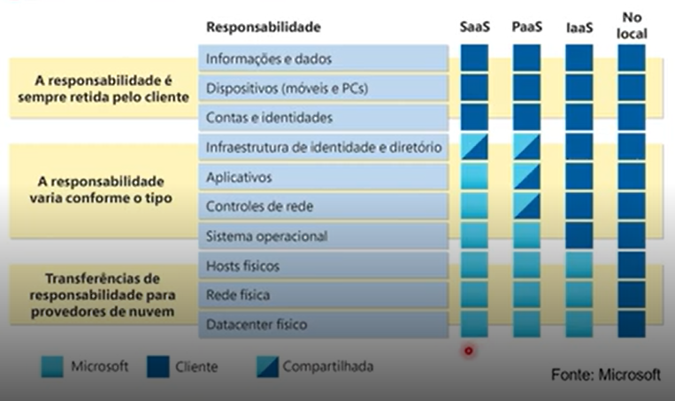
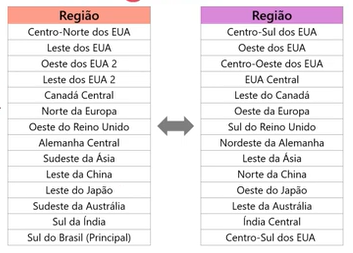
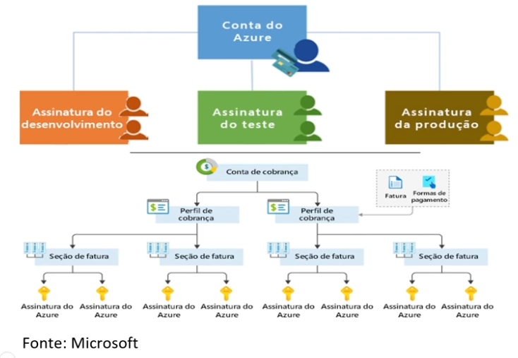
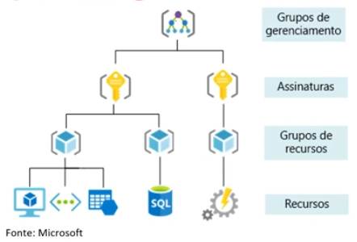
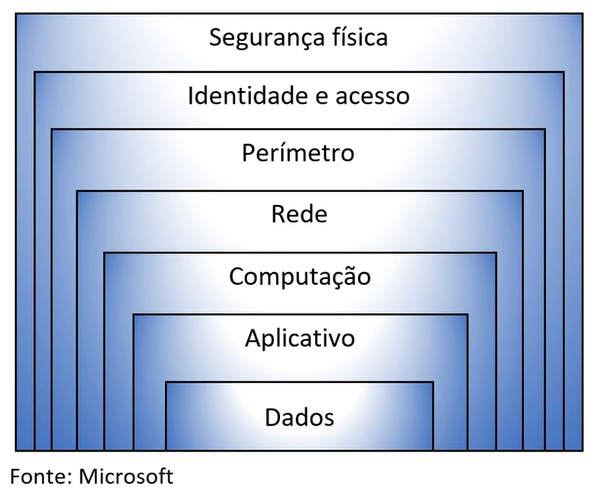

## Resumo lab introdução ao Azure
### **Módulo 1**
No laboratório de introdução à computação em nuvem e ao Azure da DIO, aprendi sobre os seguintes tópicos:
- Todas as ferramentas que existem disponíveis no Azure (armazenamento, banco de dados, etc)
- Modelos de nuvens: Nuvens privadas, públicas e híbridas
- CapEx e OpEx (tipos de pagamentos):
  - O CapEx é para capital, que seria a infraestrutura para máquinas. E seu custo diminui com o tempo
  - O OpEx é o valor de operações, como uma mensalidade dos recursos da nuvem utilizados.
 

### **Módulo 2**
No módulo 2, titulado "Benefícios da Nuvem: Escalabilidade e Elasticidade", aprendi sobre os seguintes assuntos:
- Alta disponibilidade -> tempo que um serviço estará disponível para uso. Esse tempo é medido em porcentagem, como 99%, 99,99% ou 99,95%. Isso, e muito mais é definido no SLA (Service Level Agreement) do cloud provider.
- Escalabilidade -> capacidade de ajustar recursos para atender à demanda. Quando a demanda abaixa, diminui recursos, quando aumenta, acrescenta recursos.
  - Vertical -> se um aplicativo precisa de mais processamento, é possível *escalar verticalmente* para adicionar mais CPUs ou RAM à máquina virtual.
- Elasticidade -> se houvesse um salto repentino na demanda, os recursos poderiam ser expandidos (automaticamente ou manualmente).
  - É possível adicionar VMs ou contêineres por meio da expansão. E se houver uma queda na demanda, os recursos podem ser reduzidos horizontalmente (automaticamente ou manualmente).
- Confiabilidade -> a nuvem tem design descentralizado, então naturalmente dá suporte a uma infraestrutura confiável. Também permite que tenha recursos implantador em diferentes regiões do mundo.
- Previsibilidade -> permite avançar com confiança, seja no desempenho ou no custo.
- Segurança -> a nuvem oferece ferramentas de segurança, mas a implementação de grande parte delas precisam ser feitas pelo cliente.
  - Se desejar que a aplicação de patches e manutenção sejam tratadas automaticamente, as implantações de PaaS ou SaaS podem ser as melhores estratégias de nuvem.
- Governança -> auditoria baseada em nuvem que ajuda a sinalizar qualquer recurso que esteja fora de conformidade com seus padrões corporativos e fornece estratégias de mitigação.
  - Dependendo do modelo, patches de software e atualizações também podem ser aplicados automaticamente, ajudando na governança e na segurança.
  - Estabelecendo uma presença de governança o mais cedo possível, permite manter a presença de nuvem atualizada, protegida e bem gerenciada.
- Gerenciabilidade -> um dos principais benefícios: opções de capacidade de gerenciamento. 
  - O gerenciamento da nuvem tem como exemplo: escalar automaticamente a implantação de recursos com base na necessidade.
  - Implantar recursos cmo base num modelo pré-configurado, removendo a necessidade de configuração manual.

 

Tabela de indisponibilidade em porcentagem SLA (Azure):
|SLA|Inatividade por semana|Inatividade por mês|Inatividade por ano|
|---|---|---|---|
|99%|1,68 hora|7,2 horas|3,65 dias|
|99,9%|10,1 minutos|43,2 minutos|8,76 horas|
|99,95%|5 minutos|21,6 minutos|4,38 horas|
|99,99%|1,01 minuto|4,32 minutos|52,56 minutos|
|99,999%|6 segundos|25,9 segundos|5,26 minutos|

Caso o tempo de indisponibilidade no período seja maior do que o definido, é permitido pedir ressarcimento.

 

### **Módulo 3**
Módulo sobre tipos de serviço de nuvem na Azure: IaaS, PaaS e SaaS.  
- IaaS (Infraestrutura como Serviço) -> servidores e armazenamentos; firewalls/segurança de rede; planta física/edifício do datacenter. 
  - O modelo mais personalizável, pois pode gerir quase tudo: SO da máquina virtual, configurações de rede, segurança etc, já que é apenas uma infraestrutura que vem do provedor.
- PaaS (Plataforma como serviço)-> engloba o IaaS, sistemas operacionais e ferramentas para desenvolvedores, análise de negócios de gerenciamento de database. Não se envolve com a infraestrutura, apenas a aplicação disponibilizada.
  - Como exemplo a configuração de um banco de dados: nome do servidor, localização, como vai ser autenticado.
- SaaS (Software como Serviço) -> aplicativos e apps hospedados. Microsoft Teams. Esse é o nível mais "alto": quanto mais o nível sobe, menos os administradores precisam configurar coisas. Os usuários pagam pelo software que utilizam em um modelo de assinatura.
- Modelo de responsabilidade compartilhada -> na Azure, existe esse modelo, que define como se divide a responsabilidade entre o cliente e a Microsoft.  

Na tabela abaixo, o "No local" é um modelo on-premise, onde toda responsabilidade é do cliente. Conforme vai indo para a esquerda, a responsabilidade vai caindo mais para o provedor.  
Há responsabilidades completamentes do cliente (as 3 de cima) e as apenas do provedor (as 3 de baixo, excluindo o on-premise).

### **Módulo 4**
Módulo sobre Componentes de Arquitetura do Azure.
- Existe um mapa de zonas de disponibilidade do Azure. Os pontos completos em azul são as zonas que já existem e podem ser utitlizadas, e os círculos com a linha fina sendo locais planejados.
  - Quando se cria um recurso, é preciso escolher onde ele vai ficar de acordo com esse mapa. É bom escolher em um perto do local que tem a maior quantidade de usuários, pois se for longe demais pode ter mais delay de comunicação. O valor dos recursos irão variar de acordo com a região, e até possui alguns que não estarão disponíveis em algum lugar.
  - As regiões são compostas de um ou mais datacenters próximos. Isso acontece para a replicação de dados, para permitir que os dados tenham alguma segurança, e mesmo que mais lento, o serviço possa permanecer disponível.
    - O backbone da Microsoft permite a comunicação exclusiva entre seus datacenters, de baixa latência.
    - As regiões fornecem flexibilidade e escala para reduzir a latência do cliente. Também preservam a residência dos dados com uma oferta abrangente de conformidade. Conformidade essa com a LGPD.
  - As zonas de disponibilidade fornecem proteção contra tempo de inatividade devido a falha do datacenter, e definem que, quando um hack ou máquina para de funcionar, existe outro para fazer seu papel. Também separam fisicamente os datacenters dentro de uma mesma região.
- Pares de regiões -> no mínimo 300 milhas de separação entre pares e regiões. "Duplinhas" (par) de regiões. Cada par tem replicação automática para alguns serviços.

*Nota: É possível ver com mais detalhes os pares de regiões no site oficial da Azure ([link]( https://datacenters.microsoft.com/globe/explore/)). Onde sempre atualiza todas as regiões disponíveis e mostra os pares de regiões de cada datacenter.*

- Regiões soberanas do Azure -> atende às necessidades de segurança e conformidade das agências federais, governos estaduais e locais dos EUA e seus provedores de soluções. Atendem agências militares, não aparecendo como uma região para clientes padrões.
  - Também tem a Azure China -> a Microsoft é o primeiro provedor estrangeiro de serviços de nuvem pública da China, em conformidade com as regulamentações governamentais. Tem instância fisicamente separada dos serviços de nuvem do Azure, operados pela 21Vianet. Todos os dados permanecem dentro da China para garantir conformidade.
- Os recursos do Azure -> componentes como armazenamento, máquinas virtuais e redes que estão disponíveis para criar soluções de nuvem.
  - Grupo de recursos -> caixa de bugigangas, onde você vai juntando recursos (web, banco de dados, VMs, armazenamento) em um grupo. Ou criando os recursos e linkando eles.
  - Os recursos podem existir em apenas um grupo de recursos. Podem existir em diferentes regiões. Eles podem ser movidos para diferentes grupos de recursos. Os apps podem utilizar vários grupos de recursos.
- Assinaturas do Azure -> uma única conta do Azure pode criar assinaturas para cada área: assinatura de desenvolvimento, assinatura do teste, assinatura de produção.
  - Uma conta pode ter várias assinaturas, mas uma assinatura pode pertencer à somente uma conta (1..n).
  - Uma assinatura do Azure fornece acesso autenticado e autorizado às contas do Azure.
  - Limite de cobrança -> gere relatórios de cobrança e faturas separados para cada assinatura.
  - Limite do controle de acesso -> gerenciar e controlar o acesso aos recursos que os usuários podem provisionar com assinaturas específicas. Cada assinatura provisiona recursos diferentes.

- Grupos de gerenciamento -> Define regras padrões para assinaturas. Criado automaticamente para uma conta, mas é possível criar manualmente. Eles podem incluir várias assinaturas. As assinaturas herdam as condições aplicadas ao grupo de gerenciamento.

### **Módulo 5**
Este módulo é sobre Computação e Rede na Azure.
- **Computação do Azure** -> serviço sob demanda que fornece recursos de computação, como discos, containers, AKS, processadores, memória, rede e SOs.
- **VMs do Azure** -> são emulações de software de computadores físicos, que inclui processador virtual, memória, armazenamento e rede. IaaS que oferece personalização e controle total.
- **Conjuntos de dimensionamentos de VMs** -> oferecem oportunidade de balanceamento de carga para dimensionar recursos automaticamente.
- **Conjuntos de disponibilidade de VM** -> domínio de falha (cada hack), domínio de atualização (conjunto de pelo menos uma máquina de 3 domínios de falha). Os conjuntos são separados em domínios de falha para evitar problemas de disponibilidade (falta de energia, por exemplo).
- **Área de trabalho virtual do Azure** -> cria um ambiente de virtualização do desktop. Reduz o risco que o recurso seja deixado para trás (gerenciamento melhor do desktop de cada funcionário). Possui implantações de várias sessões. Não permite que alguém transfira coisas de lá para fora. Foenece experiência de área de trabalho do Windows baseada em nuvem.
  - Aplicativos dedicados para conexão e uso ou acessíveis de qualquer navegador moderno. 
  - O logon de vários clientes permite que vários usuários façam logon no mesmo computador ao mesmo tempo.
- **Contêineres do Azure** -> ambiente leve e virtualizado que não exige o gerenciamento do SO e pode responder a alterações sob demanda. Um serviço baseado nele é leve, pode ser alocado e destruído a qualquer momento, fazendo ele a opção ideal para a execução de microsserviços.
  - Instâncias de container do Azure -> oferta de PaaS que executa um container ou pod de containers no Azure.
  - Aplicativos de container do Azure -> oferta de PaaS, como instâncias de containers, que pode balancear a carga e escalar.
- Serviço de Kubernetes do Azure (AKS) -> serviço de orquestração de containers com arquiteturas distribuídas e grandes volumes de containers.
- **Azure Functions** -> oferta de PaaS que dá suporte à operações de computação sem servidor.
  - É um código baseado em eventos, que é executado quando chamado, sem exigir uma infraestrutura de servidor durante períodos inativos.
- **Máquinas virtuais** -> servidor baseado em nuvem que dá suporte a ambientes Windows ou Linux. Útil para migrações de lift-and-shift (carregar máquinas do modelo on-premise para a nuvem, quase literalmente) para a nuvem. Pacote do SO completo, incluindo SO do host.
- **Serviços de Aplicativos do Azure** -> plataforma totalmente gerenciada para criar, implantar e dimensionar aplicativos web e APIs rapidamente.
  - Trabalha com .NET, .NET Core, Node.js, Java, Python ou PHP.
  - Também é uma ofeta de PaaS.
- **Serviços de rede do Azure (Vnet)** -> permite que os recursos do Azure se comuniquem entre si, com a Internet e redes locais. Possui pontos de extremidades públicos (acessíveis de qualquer lugar da Internet) e privados (acesso somente dentro da rede).
  - As sub-redes virtuais segmentam a rede para atender às necessidades. O emparelhamento de rede conecta suas redes privadas diretamente.
- **Gateway de VPN** -> usado para enviar tráfego criptografado entre uma rede virtual do Azure e uma no local pela Internet pública.
- **ExpressRoute** -> estende redes locais para o Azure por meio de uma conexão privada.
- **DNS do Azure** -> confiabilidade e desempenho aproveitando uma rede global de servidores de nome DNS usando a rede Anycast. A segurança dele baseia-se no gerenciador de recursos do Azure.
  - As redes virtuais personalizáveis permitem que use nomes de domínios privados em redes virtuais privadas.

### **Módulo 6**
Módulo sobre Identidade, acesso e segurança.
- **Microsoft Entra ID** -> serviço de gerenciamento de identidades e acesso baseado em nuvem do Microsoft Azure.
  - ID do Microsoft Entra: Autenticação (funcionários entram para acessar recursos), Logon único (SSO - autentica uma vez, autentica automaticamente para as outras ferramentas), Gerenciamento de aplicativos, Negócios para Negócios (B2B - se é confiável para uma plataforma, é confiável para outra), Gerenciamento de dispositivos.
- **Microsoft Entra Domain Services** -> gerenciamento de domínios e sincronização de usuários. Se o usuário é criado localmente, é replicado na nuvem, mas caso seja criado na nuvem, não vai para o local.
- **Autenticação x autorização**
  - **Autenticação** é identificar a pessoa ou serviço buscando acesso ao recurso. Solicita credenciais de acesso legítimo. É a base para criar princípios de identidade e controle de acesso seguros.
  - **Autorização** determina o nível de acesso de uma pessoa ou serviço autenticado. Define quais dados eles podem acessar e o que podem fazer com eles.
- **Autenticação multifator (MFA)** -> fornece segurança adicional para as identidades, exigindo dois ou mais elementos para autenticar completamente.
  - Segue três estrátegias:
    1. Algo que você sabe -> nome de usuário e senha.
    2. Algo que voce possui -> alguma chave ou documento.
    3. Algo que você é -> sua própria identidade.
- **B2B do Microsoft Entra External ID** -> outros serviços fazer colaboração para autenticar o usuário, e também permite autenticação dentro do Microsoft Entra. Mas nesse caso, seria apenas um convidado, para não comprometer o serviço.
- **B2C do Identidades Externas do Azure AD** -> fazer a inscrição no serviço do Azure AD B2C, trazendo a identidade externa, e não precisar refazer todos os passos de autenticação.
- **Acesso Condicional** -> Com base em vários fatores: Associação de usuário ou grupo, Local do IP, dispositivo, aplicativo e detecção de risco, ele pode determinar se o usuário pode logar no serviço ou não.
- **Controle de acesso baseado em função (RBAC)** -> Gerenciamento de acesso de granularidade fina (separa o acesso de cada recurso). Divide as tarefas dentro da equipe e conceda somente a quantidade de acesso que os usuários precisam para trabalhar. Habilita o acesso ao portal do Azure e o controle de acesso aos recursos.
  - Existe o versionamento de acesso (como uma árvore, quanto mais alto, mais acesso), quanto mais específico, você tem acesso à apenas um recurso.
- **Confiança Zero** -> diferente da abordagem clássica, que restringe tudo a uma rede "segura", ele protege os ativos em qualquer lugar com uma política central. Sempre aplicar o conceito de menor privilégio, e proteger o recurso ao máximo.
- Proteção completa -> abordagem em camadas para proteger sistemas de computador, fornece vários níveis de proteção. Ataques contra uma camada são isolados das camadas subsequentes.

Camadas de defesa em profundidade:  

- **Microsoft Defender para Nuvem** -> serviço de monitoramento que fornece proteção contra ameaças nos datacenter do Azure e locais. Tem conectividade com AWS e GCP.
- **Recursos do Azure** -> fornece recomendações de segurança, detecta e bloqueia malware, analisa e identifica ataques potenciais, faz controle de acesso just-in-time para portas.

Diferente do modelo on-premise, na nuvem, é possível separar o permissionamento para cada usuário, definindo o que cada um pode ou não pode acessar.  
